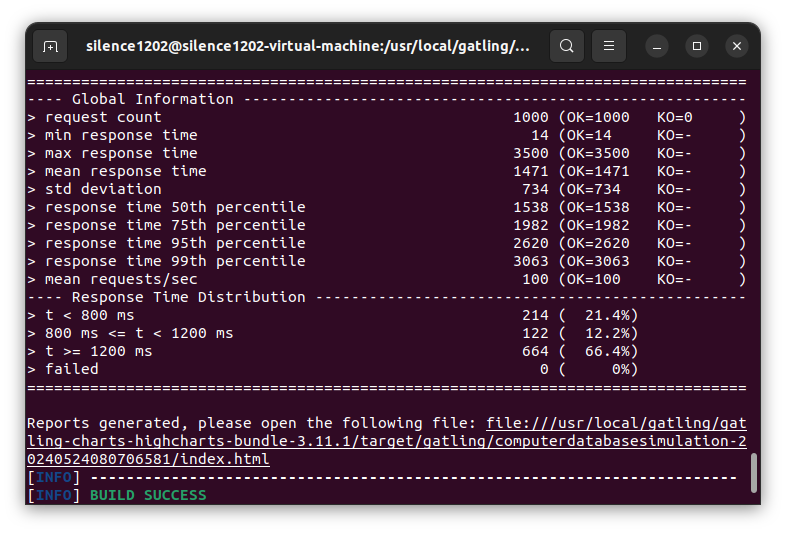
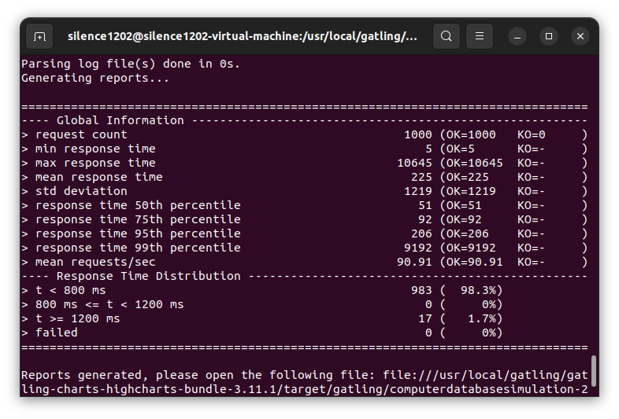
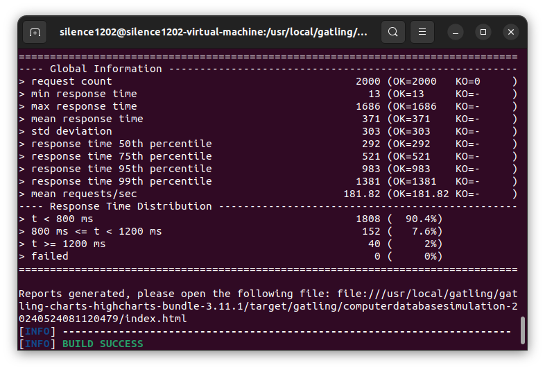

[](https://classroom.github.com/a/IMEm063v)
# Micro WebPoS 


请参考spring-petclinic-rest/spring-petclinic-microserivces 将webpos项目改为微服务架构，具体要求包括：
1. 至少包含独立的产品管理服务、订单管理服务以及discovery/gateway等微服务架构下需要的基础设施服务；
2. 请将系统内的不同微服务实现不同的计算复杂度，通过压力测试实验验证对单个微服务进行水平扩展（而无需整个系统所有服务都进行水平扩展）可以提升系统性能，请给出实验报告；
3. 请使用`RestTemplate`进行服务间访问，验证Client-side LB可行；
4. 请注意使用断路器等机制；
5. 如有兴趣可在kubernetes或者minikube上进行部署。

请编写readme对自己的系统和实验进行详细介绍。
————————————————————————————————————————————————————————————————————————————————————

##水平扩展测试：

先用mvn install将products打包为jar文件，
再利用webpos-products下的文件Dockerfile进行打包，利用haproxy.cfg进行水平扩展

利用gatling进行压力测试。rampUsers(1000).during(10), 访问：8080/product

单节点情况1000用户：
[]

双节点情况1000用户：
[]

双节点情况2000用户：
[]

可见对单个微服务的水平扩展带来的性能提升显著。


———————————————————————————————————————————————————————————————————————————————————————————

##项目介绍

启动服务顺序：webpos-api, webpos-discovery, webpos-gateway, webpos-orders, webpos-products

运行 

```
mvn spring-boot:run
```
启动客户端于client目录下，访问网页localhost:5502/dist
```
http-server ./ -p 5502
```

##功能

后端各个模块注册到8761端口的eureka注册中心discovery。
由网关webpos-gateway实现转发，将客户端的8080端口请求转发到8081端口，
由webpos-products服务实现商品管理，并利用restTemplate进行跨服务调用8083端口的webpos-orders创建订单
webpos-api定义共用的api与DTO，将服务中的实体抽象成DTO，需要mapper进行映射，使得跨服务接受数据时不需要关注实例本身，提高代码复用性

##断路器

所有服务都有其yml配置文件，有关products下的断路器配置：
```
resilience4j:
  circuitbreaker:
    instances:
      products-breaker:
        sliding-window-type: COUNT_BASED
        failure-rate-threshold: 50
        minimum-number-of-calls: 5
        automatic-transition-from-open-to-half-open-enabled: true
        wait-duration-in-open-state: 5s
        permitted-number-of-calls-in-half-open-state: 3
        sliding-window-size: 10
        register-health-indicator: true
```
断路器理解：
1.闭合状态（正常运行）：
断路器初始处于此状态，允许请求流经服务。
它会监控故障，通常基于阈值（如故障率或超时时间）触发。

2.打开状态（服务隔离）：
如果故障阈值超出，断路器跳闸并进入打开状态。
它会阻止对故障服务的调用，立即返回错误，而不是尝试连接。
这可以防止进一步的资源浪费在注定失败的调用上。

3.半开状态（测试恢复）：
经过一段超时时间后，断路器谨慎地进入半开状态。
它允许少量探测或测试请求通过，以检查服务是否已恢复。

4.返回闭合状态或打开状态:
如果探测成功，断路器认为服务健康，并返回闭合状态。
如果探测失败，断路器会重新进入打开状态以保护系统。

项目中，如果关闭orders服务，故障率高低就会使得请求异常调用fallback返回的信息不同，反映了断路器是否开启以确保服务安全。
